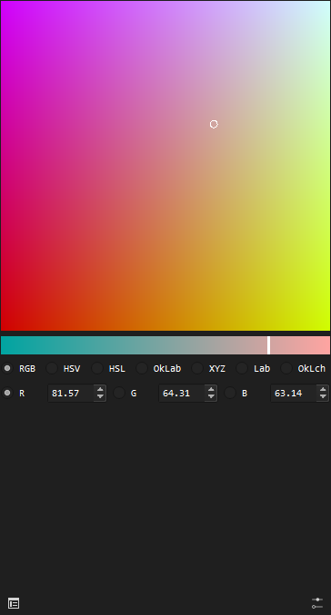
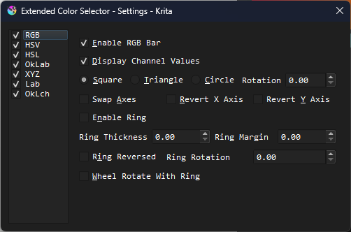
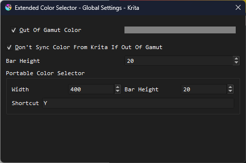
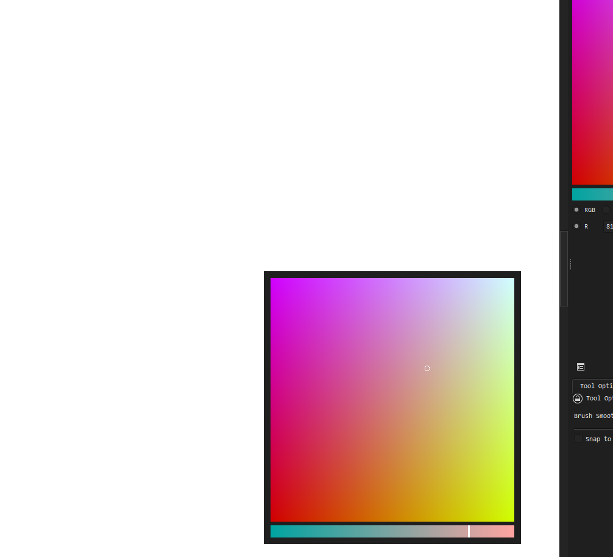

# Extended Color Selector

A powerful color selector for [`Krita`](https://krita.org/) 5.

## Features

- Supports color picking in 7 color models. (`RGB`, `HSV`, `HSL`, `OkLab`, `XYZ`, `Lab`, `OkLch`)
- Fully modular, and high customizable.
  - Three wheel shapes: square, triangle, and circle.
  - Horizontal bar and ring to modify the third channel.
  - Swappable and revertable axes.
  - Color picker rotate with ring.
- Flexible and tiny. Thanks to OpenGL shaders and mathemagics, we can draw color wheels realtime.
- Portable color selector. Open the selector at anywhere on canvas using shortcut.

## How to use

Go to Releases, download the latest package.

Go to you Krita preference directory, which is, by default,

- `$HOME/.local/share/krita/` for Linux
- `%APPDATA%\krita\` for Windows
- `~/Library/Application Support/Krita/` for macOS

Unzip the plugin package into `pykrita` folder. So there will be one more `extended_color_selector.desktop` and `extended_color_selector` inside `pykrita`.

Launch Krita.

***!!IMPORTANT!!*** If you see an error message that tells you OpenGL context is missing, please set canvas acceleration method to OpenGL in settings. `Settings -> Configure Krita -> Display -> Canvas Acceleration -> Preferred Renderer` and select OpenGL.

Go to `Settings -> Configure Krita -> Python Plugin Manager`, find `Extended Color Selector`, enable it, and restart Krita.

## Why the name

To make it looks/sounds like a native Krita docker, just like wide-gamut color selector and advanced color selector.

## Screenshots

## Credits

Color model conversion functions are translated from [`Bevy`](https://bevy.org/) project, in `bevy_color` rust crate, and under `MIT` license. It's a very nice open-source game engine written in rust.
