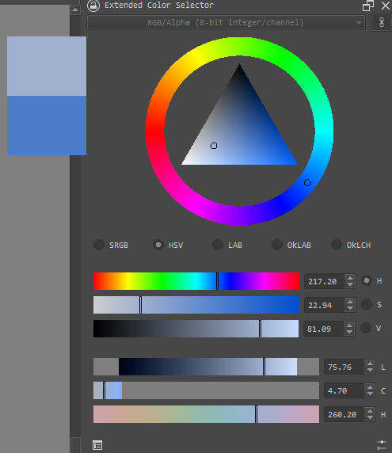
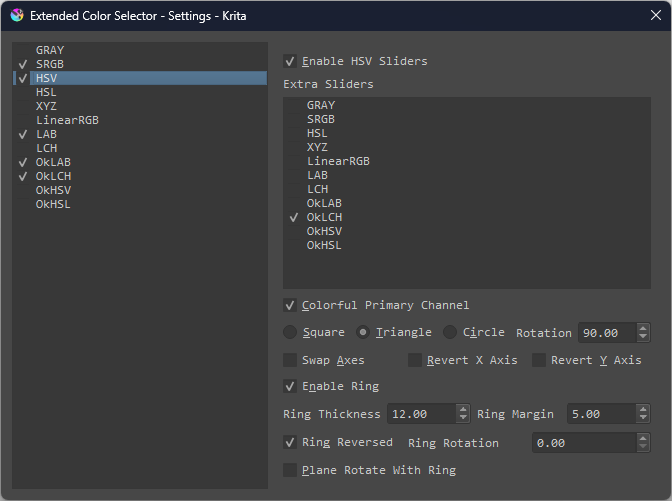
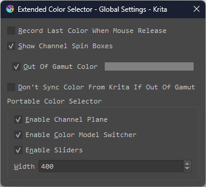

# Extended Color Selector

A powerful color selector for [`Krita`](https://krita.org/) 5.

## Features

- Supports color picking in 11 color models. (`Gray`, `SRGB`, `HSV`, `HSL`, `LinearRGB`, `XYZ`, `Lab`, `OkLab`, `OkLch`, `OkHsv`, `OkHsl`, `Normal`(Normal map))
- Support HDR color picking.
- Integrated with color management from Krita. Display the correct color under specific color profile.
- Fully modular, and highly customizable.
  - Three wheel shapes: square, triangle, and circle.
  - Channel sliders and ring to modify the third channel.
  - Swappable and revertable axes.
  - Color picker rotate with ring.
  - Scale to fit SRGB gamut for color models in CIE color space.
- Portable color selector. Open the selector at anywhere on canvas using shortcut.
- `Shift` and `Alt` modifiers to shift slowly.
- Out of gamut hinting.

## How to use

Go to Releases, download the latest package.

Go to you Krita preference directory, which is, by default,

- `$HOME/.local/share/krita/` for Linux
- `%APPDATA%\krita\` for Windows
- `~/Library/Application Support/Krita/` for macOS

Unzip the plugin package into `pykrita` folder. So there will be one more `extended_color_selector.desktop` and `extended_color_selector` inside `pykrita`.

Launch Krita.

Go to `Settings -> Configure Krita -> Python Plugin Manager`, find `Extended Color Selector`, enable it, and restart Krita.

## Why the name

To make it looks/sounds like a native Krita docker, just like wide-gamut color selector and advanced color selector.

## How to download unreleased versions

Sometimes, you may want to download unreleased versions of this plugin. For example there's a bug fix, or a new feature.

- Go to [Actions](https://github.com/443eb9/ExtendedColorSelector/actions) tab.
- Click on the top most workflow run that has the name "Build Extended Color Selector (Qt5)".
- Scroll down to find the "Artifacts" section, and download the `ExtendedColorSelector-{plugin-hash}-{krita-hash}-{os}.zip` file.

And in more uncommon cases, you are using a different Krita version than the one used in CI, and even more uncommonly, the library version is changed that this plugin cannot link to it, you can

- Fork this repo.
- Modify `target_krita_commit` to the one you are using.
- Push and wait the CI.

If you are lucky enough, when internal APIs don't change, the CI will success and you can get your plugin in the "Artifacts" section.

Well, in even even more uncommon case, the internal APIs change, uhhh, you likely have to modify the source code yourself, or wait for the next Krita release. This plugin will follow the latest Krita release.

## How to build

First, you need to follow [Building Krita from Source](https://docs.krita.org/en/untranslatable_pages/building_krita.html) page from Krita manual, and build Krita successfully.

Then, clone this repository into `krita/plugins/` folder.

The directory structure of Krita source code should be like this:

```
krita/
  ├── plugins/
  │    ├── ExtendedColorSelector/   # This repository
  │    ├── CMakeLists.txt   # The CMakeLists.txt you are going to modify
  │    └── ...
  └── ...
```

Next, open `CMakeLists.txt`, and add this line after the last `add_subdirectory( ... )` line:

```cmake
add_subdirectory( ExtendedColorSelector )
```

Finally, build again, and in the install directory, you will find the plugin `extended_color_selector`.

- On Windows, it should at `_install\extended_color_selector`
- On Linux, it should at `/home/appimage/appimage-workspace/krita.appdir/usr/extended_color_selector` inside the container.

It is recommended to create symlinks in `pykrita` folder to the install folder so you don't need to manually copy after every build.

## Screenshots





## Credits

Code from `extension.py` was copied from [krita-vision-tools](https://github.com/Acly/krita-vision-tools), which is a nice plugin allowing you to select objects with power of neural networks, and modified a little bit.

Most color model conversion functions are translated from [`Bevy`](https://bevy.org/) project, in `bevy_color` rust crate, and under `MIT` license. It's a very nice open-source game engine written in rust.

`ok_color.h` downloaded from [Björn Ottosson's Blog](https://bottosson.github.io/misc/ok_color.h) , and tuned a bit for the project, under `MIT` license.
